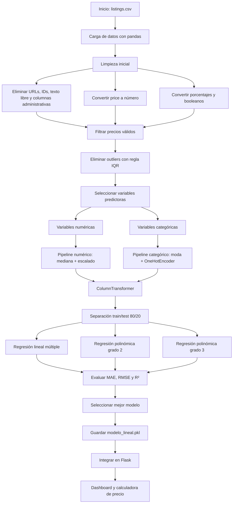

# Airbnb CDMX - Price Predictor

Dashboard interactivo de Machine Learning para predicción de precios de Airbnb en Ciudad de México.

## Stack

- **Backend**: Python, Flask, Scikit-Learn
- **Frontend**: HTML5, CSS y JavaScript
- **Visualizaciones**: Plotly.js y Leaflet.js
- **Datos**: [Inside Airbnb - Mexico City](https://insideairbnb.com/mexico-city/)

## Funcionalidades

- 6 gráficas interactivas: correlación, boxplot, scatter y coeficientes.
- Mapa interactivo con 3,000 listings coloreados por precio.
- Ranking de las 16 alcaldías de CDMX por precio mediano.
- Calculadora de precio en tiempo real con Machine Learning.
- Comparativa de 3 modelos: lineal, polinómica grado 2 y polinómica grado 3.

## Flujo del modelo



## Setup local

```bash
pip install -r requirements.txt
python modelo.py
python app.py
```

La app se levanta en `http://localhost:5000`.

## Modelo

| Modelo | RMSE test | R² test |
|--------|-----------|---------|
| Regresión lineal múltiple | 376.4 | **0.629** |
| Polinómica grado 2 | 457.1 | 0.453 |
| Polinómica grado 3 | 553.2 | 0.199 |

El mejor modelo es la regresión lineal múltiple con `R² = 0.63`.
